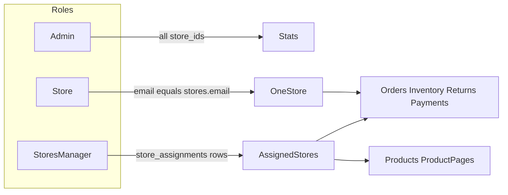

# Admin, Store, and Stores manager roles

Keep the existing Store role (one user, one store) and add a Stores manager role that can operate inventory, orders, returns, and payments across multiple assigned stores. Admin stays platform-wide, with dashboard stats fixed to cover the whole platform.

## Roles

- **Admin** — whole platform (catalog, stores, settings) and **platform-wide stats**
- **Store** — unchanged: one Clerk user maps to one store via email; own-store inventory/orders/returns/payments (read, same as today)
- **Stores manager** — Clerk role `stores_manager`; can **view and operate** inventory (including adjust), products, product pages, orders, returns, and payments **only for assigned stores**; dashboard stats **only for those stores**. No stores CRUD, manager assignment, or analytics settings.



## Assignment model

Today there is no user–store join table; store users are 1:1 by email ([`043_create_stores_schema.sql`](../database/migrations/043_create_stores_schema.sql), [`requireCurrentStore.ts`](../src/shared/server/requireCurrentStore.ts)).

Add migration `045_create_store_assignments.sql`:

- Table `store_assignments`: `email`, `store_id` (FK to `stores`), unique `(email, store_id)`
- One manager can have many rows; one store can have many assigned emails
- `email` is the same portable identity key as `stores.email` (normalized lowercase)

Role stays in Clerk `publicMetadata.role`. Assignments live in Postgres so they can be queried and enforced on the API.

**Onboarding:** [`set-role`](../src/app/api/set-role/route.ts) must **preserve** `admin` and `stores_manager`, and **must not** upsert a `stores` row for those roles (only for `store`).

Admin assigns managers in-app: look up an existing Clerk user by email (`clerkClient.users.getUserList`), set `publicMetadata.role` to `stores_manager`, then insert `store_assignments` rows. The user must have signed in at least once.

## Auth and access helper

Extend [`requireDashboardActor.ts`](../src/shared/server/requireDashboardActor.ts):

```ts
| { role: "admin"; user; store: null; storeIds: null }           // null = all stores
| { role: "store"; user; store; storeIds: [store.id] }
| { role: "stores_manager"; user; store: null; storeIds: number[] }
```

Add `assertStoreAccess(actor, storeId)` and `resolveScopeStoreIds(actor, requestedStoreId?)`:

- Admin: requested id or all stores
- Store: always own id (ignore client `storeId`)
- Manager: requested id only if it is in `storeIds`; if omitted, all assigned ids. Empty assignment → empty results, not 500.

Mirror on the client in [`use-auth.ts`](../src/shared/hooks/use-auth.ts) (`isStoresManager`, label “Stores manager”). Extend [`RoleGuard.tsx`](../src/shared/components/auth/RoleGuard.tsx).

## API scoping

Replace binary `admin vs actor.store.id` with the helper above on:

- Orders list/summary/detail/items — [`orders/route.ts`](../src/app/api/orders/route.ts), [`orders/summary/route.ts`](../src/app/api/orders/summary/route.ts)
- Payments GET + mark-paid / create — scoped to assigned stores for managers
- Returns GET + collect / create / eligible — same
- Products GET (inventory list) — `store_id IN assigned`
- Inventory reads/writes (`bulk-adjust`, item quantity) — product must belong to an assigned store
- [`inventory/sold-units`](../src/app/api/inventory/sold-units/route.ts) — currently unscoped; filter by assigned stores for managers, all stores for admin

Repositories that only support a single `storeId` (e.g. [`orderService.getSummary`](../src/features/orders/data/orderService.ts)) get `storeIds?: number[]` and `.in("store_id", ids)` so manager stats can aggregate.

**Writes for managers (assigned stores only):** inventory adjust, product create/update, product pages create/update/delete, order **status** updates, payments create/mark-paid, returns create/collect. **Create order** stays admin-only. Stores status, settings, and leads stay `requireAdminActor`.

`GET /api/stores`: admin = all; manager = assigned stores only (for pickers). Store role does not list stores.

New admin APIs:

- `GET/POST /api/managers` — list managers + assignments; add by email + store ids
- `PATCH/DELETE /api/managers/[clerkUserId]` — update assigned stores / demote

## UI

**Nav** ([`StoreSidebar.tsx`](../src/shared/components/layout/StoreSidebar.tsx)): managers see workspace (home, inventory, orders, returns, payments) plus catalog (products, product pages). Settings hidden. Admin-only section is stores + managers.

**Store picker:** reuse the admin store select on orders/inventory/returns/payments for managers, fed by assigned stores, plus “All assigned” where stats/lists support multiple ids.

**Dashboard home** ([`DashboardHomeView.tsx`](../src/features/dashboard/presentation/DashboardHomeView.tsx)):

- Admin: platform-wide orders **and** payments + inventory aggregates (today payments are disabled with `null` store and inventory is only the first product)
- Manager: same cards, filtered to assigned stores
- Store: unchanged (own store)

**Stores page:** show assigned managers per store. **New admin page** `/dashboard/managers`: email + multi-store assignment.

Replace `isAdmin` branches in [`OrdersManagementView`](../src/features/orders/presentation/OrdersManagementView.tsx), [`InventoryManagementView`](../src/features/inventory/presentation/InventoryManagementView.tsx), [`PaymentsManagementView`](../src/features/payments/presentation/PaymentsManagementView.tsx), [`ReturnsManagementView`](../src/features/returns/presentation/ReturnsManagementView.tsx) with capability flags (`canPickStore`, `canMutateInventory`, `canMutatePayments`, `canChangeOrderStatus`, `isPlatformAdmin`).

## Tests

- `resolveDashboardRole` (admin / store / stores_manager / partner→store)
- Scope helper: admin all, store locked, manager allow/deny
- Manager APIs cannot pass another store’s `storeId`
- RoleGuard redirects managers away from stores/managers pages; allows products and product pages

## Implementation checklist

- [ ] Add `store_assignments` migration and domain/service for assignments
- [ ] Extend DashboardActor, useAuth, RoleGuard, and set-role preservation
- [ ] Scope orders/inventory/payments/returns APIs + `storeIds` filters
- [ ] Admin managers UI + store picker/stats for manager vs platform admin
- [ ] Unit tests for role resolution, store access, and RoleGuard
